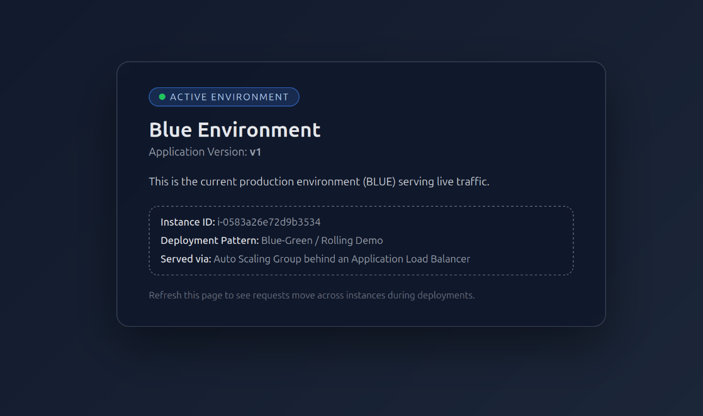
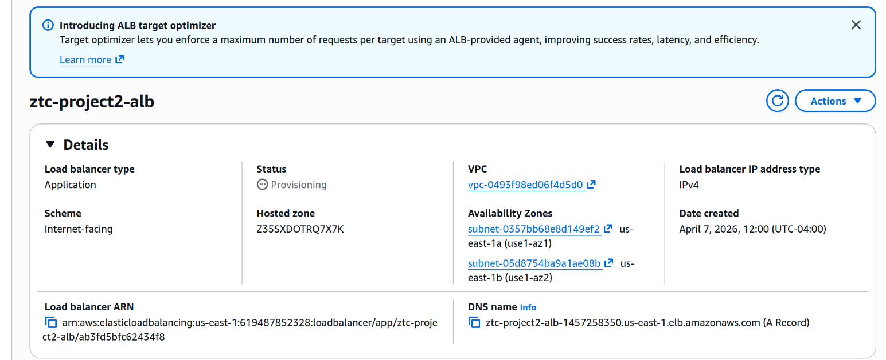
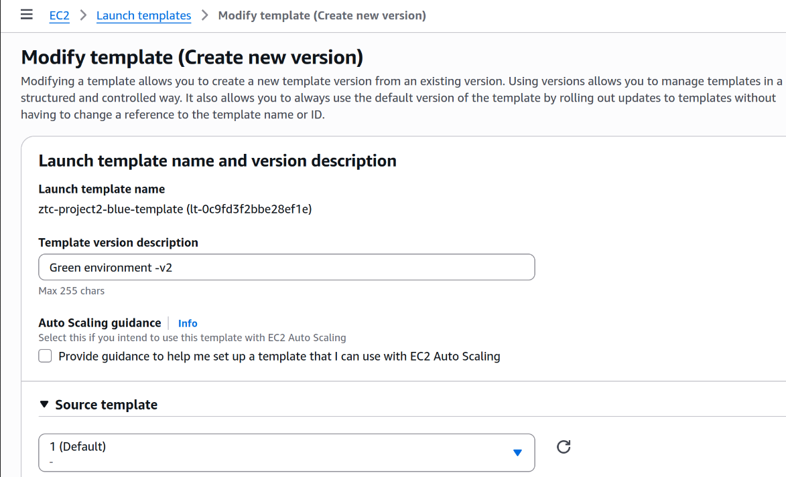
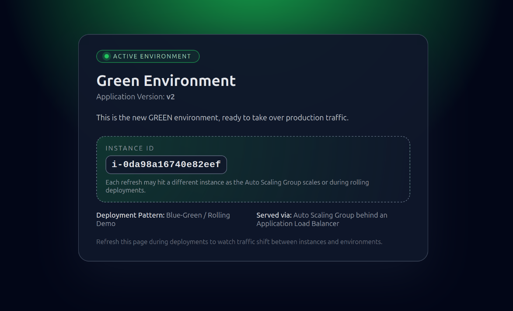
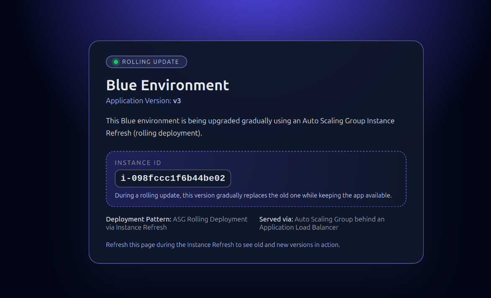

# AWS Blue/Green Deployment
Designed and implemented a production-style Blue/Green deployment on AWS to enable zero-downtime releases and reduce deployment risk using an Application Load Balancer.

## 📌 Overview
This project demonstrates a Blue/Green Deployment strategy on AWS using two seperate environments behind an Application Load Balancer.

A new application version is deployed to the Green environment, validated through health checks, and then traffic is shifted from the Blue (production) environment to the Green environment with minimal downtime.

## 🎯 Key Outcomes
- Implemented a zero-downtime deployment strategy
- Reduced deployment risk using environment isolation
- Validated application health before production cutover
- Designed rollback strategy for rapid recovery
- Troubleshoot real-world AWS infrastructure issues (ALB, health checks, security groups)

## 🏗️ Architecture

## ⚒️ Services Used
- Amazon EC2 - Instances running the application
- Application Load Balancer (ALB) - Traffic distribution and routing
- Target Groups - Blue and Green routing destinations
- Launch Templates - Version-controlled instance configuration
- IAM - Instance roles and permissions
- VPC, Subnets, Security Groups - Networking and access control
- User Data (Bash)

## 🚀 Deployment Workflow
### 1. Deploy Blue Environment (Production)
Created the initial production environment by launching EC2 instances using Launch Templates and registering them with the Blue Target Group.

### 2. Configure Application Load Balancer
Set up an Application Load Balancer to route traffic to the Blue environment.

### 3. Deploy Green Environment (New Version)
Launched new EC2 instances using a launch template and registered them in a seperate Green target group.

### 4. Validate Health Checks
Ensured Green environment instances passed ALB health checks before shifting traffic.

### 5. Traffic Shift
Updated ALB configuration to route traffic from Blue to Green.

### 6. 🔙 Rollback Strategy
If issues are detected:
- Re-route traffic back to Blue target group
- Restore previous stable version instantly

### 7. ⚠️ Challenges & Solutions
#### ALB returning 502 Bad Gateway
- Cause: Web server not initialized properly
- Fix: Ensured Apache installed and running via User Data

#### Health checks failing
- Cause: Incorrect security group configuration
- Fix: Allowed inbound traffic on port 80

#### SSH issues
- Cause: Security group restrictions
- Fix: Allowed port 22 access from trusted IP

## 🧠 Key Skills Demonstrated
- Cloud architecture design
- Load balacing and traffic routing
- Blue/Green deployment strategy
- Infrastructure troubleshooting
- Linux server configuration

## 🚀 Future Improvements
- Automate infrastructure with Terraform
- Implement AWS CodeDeploy for automated deployments
- ADD CI/CD Pipeline
- Integrate CloudWatch monitoring alerts

